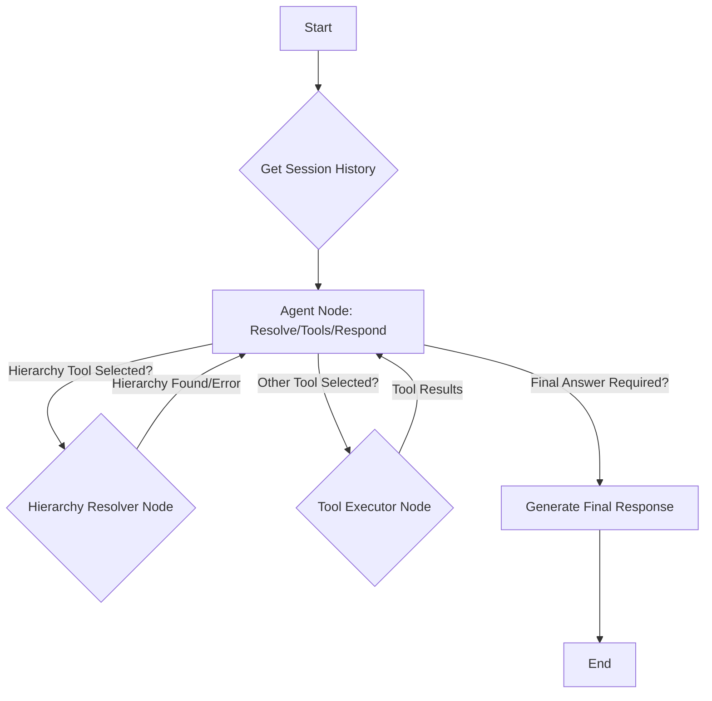

# Bibliotheca Chatbot API Architecture

## 1. System Overview

The Bibliotheca Chatbot API is a production-grade FastAPI application that processes natural language queries about library data. It integrates with PostgreSQL databases, uses **LangGraph** for agent orchestration, maintains conversation state with **RunnableWithMessageHistory**, and leverages Azure OpenAI's GPT-4o for natural language understanding and generation. It can produce visualizations as static PNG files served via URL.

### Key Features
- Natural language query processing for library data
- Multi-modal responses (text, tables, charts)
- Context-aware conversations with **integrated memory management**
- Integration with multiple PostgreSQL databases
- Dynamic visualization generation (using **Matplotlib/Seaborn**, saved as PNG files with URL access)
- Schema-first approach for accurate SQL generation
- **Refined graph-based agent execution for controlled, sequential workflow (e.g., resolver first)**
- **Agent directly generates final response structure via tool binding**
- Robust error handling with specific error types
- **Strict guardrails for out-of-scope queries**
- Data-driven handling of analytical queries (e.g., "is it busy?") with optional benchmarking

### Target Users
- Library administrators and staff accessing via Flutter mobile app
- Users seeking insights about library data

## 2. Architecture Components

```
┌─────────────────┐      ┌───────────────────────┐      ┌─────────────────┐
│   FastAPI API   │◄────►│ LangGraph App         │◄────►│ PostgreSQL DBs  │
└─────────────────┘      │ (Agent + Tool Nodes)  │      └─────────────────┘
                         │ (w/ Memory)           │
                         └───────────┬───────────┘
                                   │ ▲
      ┌────────────────────────────▼─┴───────────────────────────┐
      │ Tool Execution (Nodes: tools, resolve_hierarchy)        │
      │                                                         │
      │ ┌────────────┐ ┌────────────┐ ┌─────────────┐ ┌────────┐│
      │ │ SQL Tool   │ │ Chart Tool │ │ Summary Tool│ │ Resolver││
      │ └────────────┘ └────────────┘ └─────────────┘ └────────┘│
      └─────────────────────────────────────────────────────────┘
```

### Core Components

#### 1. FastAPI Layer
- Handles HTTP requests and responses (`/chat`, `/health`)
- Manages API routing and input/output validation using Pydantic schemas (`app/schemas/`)
- Invokes the LangGraph application (`process_chat_message` in `app/langchain/agent.py`)

#### 2. LangGraph Application Layer (`app/langchain/agent.py`)
- **Stateful Agent Graph:** Orchestrates the workflow using `langgraph.StateGraph`. The state (`AgentState`) includes message history, accumulated tables/visualizations, and the final response structure.
- **Agent Node:** Calls the LLM (`AzureChatOpenAI`) bound with operational tools **and** the `FinalApiResponseStructure`. Guided by `SYSTEM_PROMPT_TEMPLATE`, it decides the next action: call an operational tool (like resolver or SQL), or generate the final response by calling `FinalApiResponseStructure`.
- **Tool Nodes:** Separate nodes execute specific tools:
    - `resolve_hierarchy_node`: Executes *only* the `HierarchyNameResolverTool`.
    - `tools` node: Executes other operational tools (`SQLQueryTool`, `ChartRendererTool`, `SummarySynthesizerTool`) potentially concurrently.
- **Conditional Edges:** Route the flow based on `should_continue` logic: `agent` -> `resolve_hierarchy` (if resolver called alone), `agent` -> `tools` (if other tools called), `agent` -> `END` (if `FinalApiResponseStructure` called or no tools called). Tool nodes route back to `agent`.
- **Memory Integration:** Uses `langchain_core.runnables.history.RunnableWithMessageHistory` to automatically manage conversation history persistence (using `app/langchain/memory.py`). Session management is handled via `session_id` in the request configuration.
- **Final Response Generation:** The `agent` node LLM directly generates the arguments for `FinalApiResponseStructure` when the task is complete. The `process_chat_message` function extracts this structure from the final graph state.

#### 3. Tool Suite (`app/langchain/tools/`)
- **HierarchyNameResolverTool**: Resolves potentially fuzzy user-provided hierarchy names against the `hierarchyCaches` table for a specific organization, prioritizing exact matches.
- **SQLQueryTool**: Generates and executes organization-scoped SQL queries using predefined schema definitions. Uses user-friendly aliases. Attempts to include benchmarks (e.g., org average via CTE) for analytical queries. Returns structured data (`{"table": ..., "text": ...}`). Implements automatic row limiting.
- **ChartRendererTool**: Creates visualizations using Matplotlib/Seaborn...
- **SummarySynthesizerTool**: Generates natural language summaries. Used *after* resolver if needed, relies on its own internal data fetching.

#### 4. Database Layer (`app/db/`)
- Connects to multiple PostgreSQL databases using SQLAlchemy (`connection.py`).
- Includes predefined schema definitions (`schema_definitions.py`) used by `SQLQueryTool`.

## 3. API Endpoints

### POST /api/v1/chat
Processes user chat messages using the LangGraph application and returns multi-modal responses.

**Request:**
```json
{
  "user_id": "string",
  "message": "string",
  "session_id": "string (optional, for conversation continuity)"
  // chat_history is managed server-side via session_id
}
```

**Response:**
```json
{
  "status": "success|error",
  "data": {
    "text": "string (explanatory text)",
    "table": { // Compact table format
      "columns": ["col1", "col2"],
      "rows": [ ["val1", "val2"], ["val3", "val4"] ]
     } | null,
    "visualization": {
      "type": "bar|pie|line|scatter",
      "image_url": "string (URL path to the generated PNG, e.g., /static/charts/chart_uuid.png)"
    } | null
  },
  "error": {
    "code": "ERROR_CODE (e.g., GRAPH_EXECUTION_ERROR)",
    "message": "Error description",
    "details": {}
  } | null,
  "timestamp": "ISO datetime"
}
```

### GET /api/v1/health
Returns API health status.

**Response:**
```json
{
  "status": "healthy|degraded|unhealthy",
  "version": "string",
  "dependencies": {
    "database": "connected|disconnected",
    "azure_openai": "available|unavailable"
  }
}
```

## 4. Database Connection

- Multiple PostgreSQL databases accessed via SSH tunnel to a bastion host:
  - device_management: Contains device-related data and metrics
  - report_management: Stores reporting and analytics information
  - organization_management: Manages organizational structure and user relationships
- Connection to localhost:5433, which is forwarded to the remote database
- Connection pooling with SQLAlchemy
- Environment-based configuration
- Schema-first approach with predefined database definitions
- Optional validation of schema definitions against actual database structure

### SSH Tunnel Configuration
The application connects to databases that are in a private VPC through an SSH tunnel:
1. An SSH tunnel is established to forward the remote PostgreSQL port (5432) to local port 5433
2. The application connects to localhost:5433, which forwards to the remote database
3. This approach provides security without exposing the database directly to the internet

```bash
# Example SSH tunnel command
ssh -L 5433:loadtesting-db.cpuebrabtehq.eu-north-1.rds.amazonaws.com:5432 -i JUNTO-KEYPAIR-DEV-QA.pem ec2-user@13.60.89.207
```

## 5. LangGraph Implementation Details

### Agent State (`AgentState` in `agent.py`)
A `TypedDict` managing the conversation flow:
- `messages`: Sequence of `BaseMessage` objects (history).
- `tables`: List of tables returned by `sql_query` tool.
- `visualizations`: List of visualizations returned by `chart_renderer`.
- `final_response_structure`: Holds the parsed `FinalApiResponseStructure` object generated by the agent node.

### Graph Structure (`create_graph_app` in `agent.py`)
- **Nodes:** `agent`, `tools`, `resolve_hierarchy`
- **Entry Point:** `agent`
- **Edges:** Defined by `should_continue` logic:
    - `agent` -> `resolve_hierarchy` (if only resolver called)
    - `agent` -> `tools` (if other operational tools called)
    - `agent` -> `END` (if `FinalApiResponseStructure` called or no tools called)
    - `tools` -> `agent`
    - `resolve_hierarchy` -> `agent`

### Memory (`RunnableWithMessageHistory` in `agent.py`)
- Wraps the compiled graph (`app.compile()`).
- Uses `app.langchain.memory.get_session_history` to fetch/create `ChatMessageHistory` based on `session_id` passed in config.
- Automatically saves user (`HumanMessage`) and AI (`AIMessage`, `FunctionMessage`) messages to the history store based on graph flow.
- Input key: `messages`, History key: `messages`.

### System Prompt (`SYSTEM_PROMPT_TEMPLATE` in `agent.py`)
- Guides the `agent` node LLM.
- Focuses on decision-making (which tool to use, or call `FinalApiResponseStructure`).
- Includes tool descriptions (including `FinalApiResponseStructure`).
- Enforces workflow (resolver first).
- Provides strict guardrails for out-of-scope refusal and nuanced handling of analytical queries.

### Tool Definitions (`app/langchain/tools/`)
- Tools return structured data or strings.
- Tool node handlers (`async_tools_node_handler`, `resolve_hierarchy_node`) format outputs into `ToolMessage` objects, serializing dictionaries to JSON strings for the message content.

### Final Output Processing (`process_chat_message` in `agent.py`)
- Invokes the graph with memory using `graph_with_memory.ainvoke`.
- Extracts the `FinalApiResponseStructure` object directly from the `final_state['final_response_structure']` field (with fallback parsing if needed).
- Extracts accumulated `tables` and `visualizations` from the final state.
- Validates `include_tables` and `include_visualizations` flags against the state, defaulting if mismatched.
- Filters tables/visualizations based on flags.
- Constructs the final API response using the `ChatData` schema from `app/schemas/chat.py`, combining the text from the structure with the filtered tables/visualizations.
- **Note:** Removed the previous hybrid approach involving manual data extraction and a separate formatter LLM call.

## 6. Security Considerations

- Authentication using API keys or JWT
- User filtering for database queries
- Input validation and sanitization
- Rate limiting to prevent abuse
- SQL injection prevention

## 7. Performance Optimization

- Async operations used in LangGraph and FastAPI.
- Tool execution (DB queries, chart rendering via Matplotlib/Seaborn) remains a potential bottleneck. Matplotlib rendering is CPU-bound.
- Caching compiled graphs per `user_id` in `agent.py` avoids re-compilation.
- **Memory Scalability:** Current `ChatMessageHistory` is in-memory; replace with persistent store (e.g., Redis) in `app/langchain/memory.py` for production.
- **SQL Generation:** Efficient SQL generation (e.g., using CTEs for benchmarks instead of multiple queries) is key.

## 8. Error Handling

**Structured Error Response:**
```json
{
  "status": "error",
  "data": null,
  "error": {
    "code": "ERROR_CODE",
    "message": "Human-readable message",
    "details": {}
  },
  "timestamp": "ISO datetime"
}
```

**Error Categories:**
- Authentication errors (401, 403)
- Input validation errors (400)
- Resource not found errors (404)
- Database errors (500)
- Azure LLM service errors (503)
- Rate limiting errors (429)
- Context length exceeded errors

**Specific Error Codes:**
- AGENT_ERROR: General agent processing errors
- CONTEXT_LENGTH_EXCEEDED: Response too large for model context window
- DATABASE_ERROR: Database connection or query execution errors
- OPENAI_API_ERROR: Azure OpenAI API errors

## 9. Example Queries and Responses

### Example 1: Data Query with Text Response

**Query:** "How many books were borrowed from Branch A last week?"

**Response:**
```json
{
  "status": "success",
  "data": {
    "text": "Branch A had 143 book borrowings last week, which is a 12% increase from the previous week.",
    "table": null,
    "visualization": null
  },
  "error": null,
  "timestamp": "2023-05-15T14:22:33Z"
}
```

### Example 2: Chart Generation

**Query:** "Create a bar chart of footfall by hour for Branch B yesterday"

**Response:**
```json
{
  "status": "success",
  "data": {
    "text": "Here's the chart showing hourly footfall for Branch B yesterday.",
    "table": null,
    "visualization": {
      "type": "bar",
      "image_url": "/static/charts/chart_some_uuid.png"
    }
  },
  "error": null,
  "timestamp": "2023-05-15T14:25:12Z"
}
```

### Example 3: Table Response
**Query:** "Show active ORG hierarchies"
**Response:**
```json
{
  "status": "success",
  "data": {
    "text": "Here is the data you requested:",
    "table": {
      "columns": ["ID", "Name", "Type"],
      "rows": [
        ["abc", "Org1", "ORG"],
        ["def", "Org2", "ORG"]
      ]
     },
    "visualization": null
  },
  "error": null,
  "timestamp": "2023-05-15T14:30:45Z"
}
```

### Example 4: Error Response for Context Length Exceeded

**Query:** "Show me all data from all tables"

**Response:**
```json
{
  "status": "error",
  "data": null,
  "error": {
    "code": "CONTEXT_LENGTH_EXCEEDED",
    "message": "Your query returned too much data. Please be more specific or add additional filters.",
    "details": {
      "suggestion": "Try asking about a specific hierarchy, type, or add date/time constraints."
    }
  },
  "timestamp": "2023-05-15T14:35:22Z"
}
```

## 10. Project File Structure

```
/bibliotheca-api
  /app
    /api
      __init__.py
      chat.py
      health.py
    /core
      __init__.py
      config.py
      security.py
      logging.py
    /db
      __init__.py
      connection.py
      schema_definitions.py
    /langchain
      __init__.py
      agent.py
      memory.py
      /tools
        __init__.py
        sql_tool.py
        chart_tool.py
        summary_tool.py
    /schemas
      __init__.py
      chat.py
      errors.py
    main.py
  /static            # Added for serving chart images
    /charts
  /tests
    /unit
    /integration
    /e2e
  /docs
    ARCHITECTURE.md
  .env.example
  requirements.txt
  README.md
  Dockerfile
```

## 11. Implementation Plan

1. Set up project structure and dependencies
2. Implement database connections with SQLAlchemy
3. Create FastAPI endpoints with schema validation
4. Define comprehensive schema definitions
5. Build LangGraph tools one by one
6. Create detailed system prompt for agent
7. Configure agent with tools and memory
8. Implement error handling and logging
9. Add authentication and security
10. Optimize performance
11. Write tests
12. Create deployment configuration

## 12. Production Deployment Considerations

- Containerization with Docker
- Scaling with Kubernetes or AWS ECS
- CI/CD pipeline with GitHub Actions
- Monitoring with Prometheus/Grafana
- Log aggregation with ELK stack
- Backup and disaster recovery plan
- Resource management for large queries
- Error monitoring and alerting
- **Persistent Memory Store (e.g., Redis) is essential.**
- **Matplotlib Backend:** Ensure the deployment environment uses a non-interactive backend like 'Agg' (set via `matplotlib.use('Agg')` in code or `MPLBACKEND` environment variable).

## Agent Workflow (LangGraph)

The agent uses LangGraph to define a stateful workflow with specific nodes and conditional edges:



**Explanation:**

1.  **Start & Get History**: The process begins when a request hits the `/chat` endpoint. `RunnableWithMessageHistory` retrieves the relevant chat history for the `session_id`.
2.  **Agent Node (`agent` in `graph.add_node`)**: This is the central LLM-powered node. Based on the current state (input, history, tool results), it decides the next action:
    *   Invoke the `HierarchyNameResolverTool` if needed.
    *   Invoke another tool (`SQLQueryTool`, `ChartRendererTool`, `SummarySynthesizerTool`).
    *   Generate the final response directly if enough information is available.
3.  **Conditional Edge (`should_continue`)**: This edge determines the next step after the Agent Node:
    *   **If `HierarchyNameResolverTool` is invoked**: Route to the `Hierarchy Resolver Node`.
    *   **If any *other* tool is invoked**: Route to the `Tool Executor Node`.
    *   **If the agent decides to respond directly**: Route to the `Generate Final Response` step (effectively the end, as the response is structured by the agent).
4.  **Hierarchy Resolver Node (`hierarchy_resolver_node` in `graph.add_node`)**: Executes *only* the `HierarchyNameResolverTool`. This ensures names are resolved *before* potentially using them in other tools (like SQL).
The results (resolved names or errors) are added back to the state.
5.  **Tool Executor Node (`action` or `tools_node` in `graph.add_node`)**: Executes the selected tool (SQL, Chart, Summary). The results are added back to the state.
6.  **Looping**: After the Hierarchy Resolver or Tool Executor nodes, control returns to the Agent Node (`C`) with the updated state (tool results included). The agent then re-evaluates based on the new information.
7.  **Generate Final Response**: When the agent determines it has enough information (or cannot proceed further), it generates the final response. **Crucially, the agent itself formats the final output structure using LLM function calling/tool binding.** It decides whether to include text, table data, and/or a visualization URL by invoking a special `FinalResponse` tool/schema.
8.  **End**: The structured final response is returned to the FastAPI endpoint and sent back to the user.

## Key Design Decisions & Rationale

*   **LangGraph for Control**: Provides a robust, stateful, and debuggable way to manage the agent's flow, especially with conditional logic and loops, compared to simpler agent executors.
*   **Sequential Hierarchy Resolution**: Running the `HierarchyNameResolverTool` in a dedicated step *before* other tools (like SQL) ensures that queries use accurate, validated identifiers, preventing errors caused by ambiguous names.
*   **Direct Final Response Generation**: The agent LLM directly constructs the final JSON response structure (`text`, `table`, `visualization` flags/data) via tool binding. This eliminates the need for a separate formatting LLM call, reducing latency and complexity, and giving the agent full control over the output modality.
*   **`RunnableWithMessageHistory`**: Simplifies memory management integration directly into the runnable sequence/graph.
*   **Organization ID Scoping**: All data access (SQL queries, potentially summaries, hierarchy lookups) is strictly filtered by the `organization_id` provided in the request, ensuring data isolation.
*   **Schema-Driven SQL**: Providing table schemas in the prompt helps the LLM generate more accurate SQL queries.
*   **Tool-Based Charting**: Generating charts via a dedicated tool allows for complex visualizations using robust libraries (Matplotlib/Seaborn) and keeps the LLM focused on language tasks. Serving static files is simple and effective.
*   **Guardrails and Nuanced Analysis**: The agent's system prompt includes specific instructions to:
    *   Refuse out-of-scope or purely subjective questions.
    *   Handle analytical requests (like "is X busy?") by providing relevant data and context (e.g., comparing to averages using SQL CTEs) rather than giving a simple subjective judgment.
    *   Prioritize using resolved IDs from the `HierarchyNameResolverTool` in subsequent tool calls (e.g., SQL descriptions).

## Data Flow Example (Chart Request)

1.  User asks: "Show me borrows for Main Library vs Argyle Branch last month."
2.  FastAPI receives request (`organization_id`, `message`, `session_id`).
3.  `RunnableWithMessageHistory` loads history for `session_id`.
4.  **Agent Node**: Sees "Main Library" and "Argyle Branch". Decides `HierarchyNameResolverTool` is needed for both.
5.  `should_continue` routes to **Hierarchy Resolver Node**.
6.  `HierarchyNameResolverTool` runs, finds IDs for "Main Library" and "Argyle Branch" for the `organization_id`. Results added to state.
7.  Control returns to **Agent Node**.
8.  **Agent Node**: Sees resolved IDs and original request. Decides `SQLQueryTool` is needed to get borrow counts for these IDs.
9.  `should_continue` routes to **Tool Executor Node**.
10. `SQLQueryTool` generates and runs SQL (using resolved IDs and scoped by `organization_id`). Results (borrow counts) added to state.
11. Control returns to **Agent Node**.
12. **Agent Node**: Sees borrow counts. Decides `ChartRendererTool` is needed to visualize the comparison.
13. `should_continue` routes to **Tool Executor Node**.
14. `ChartRendererTool` generates a bar chart, saves it to `/static/charts/`, gets the URL. URL added to state.
15. Control returns to **Agent Node**.
16. **Agent Node**: Sees chart URL. Decides it has enough information. Generates the final response using the `FinalResponse` tool binding, including introductory text and the `visualization` URL.
17. `should_continue` routes to the end.
18. FastAPI returns the structured JSON response.
